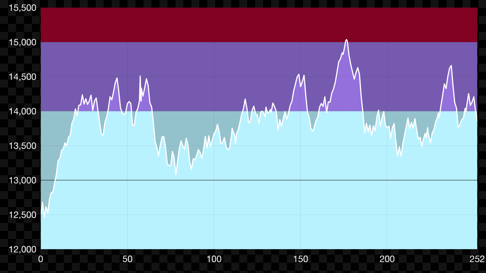

# mk8dx.js
This library has mk8dx's track data and lounge api wrapper.

## Track Data

```TypeScript
import { search } from 'mk8dx/util/track'

console.log(search('tokyo').abbr)
// 'bTB'
```

## Lounge API Wrapper

```TypeScript
import { getPlayer } from 'mk8dx/lounge'

getPlayer({ name: 'sheat' })
    .then(player => {
        console.log(player.switchFc)
        // '6986-4603-1885'
    })
```

## Lounge Chart

```TypeScript
import { Chart } from 'chart.js'
import { createCanvas } from 'canvas'
import * as fs from 'fs'
import { getPlayerDetails } from 'mk8dx/lounge'
import { createStatsConfig, createStatsData } from 'mk8dx/lounge/chart'

const playerDetails = await getPlayerDetails({ name: 'kusaan', season: 7 })
const canvas = createCanvas(1280, 720)
new Chart(canvas.getContext('2d'), createStatsConfig({
    season: playerDetails.season,
    data: createStatsData(playerDetails.mmrChanges)
}))
fs.writeFile('stats.png', canvas.toBuffer('image/png'))
```


